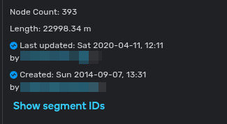
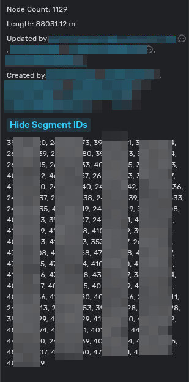
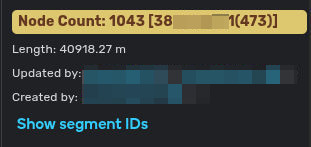
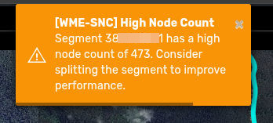
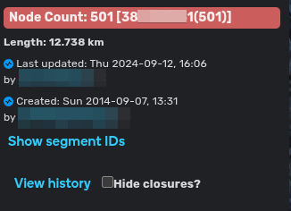
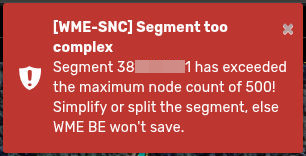
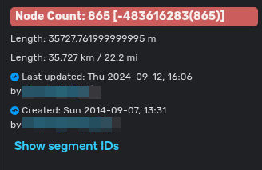
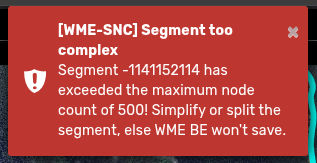

# WME Segment Node Count Script

This script shows the number of geo-nodes in a given selection of segments, 
within the segment attribute panel of Waze Map Editor (WME), 
under additional attributes section at the bottom.

It warns if a segment is too complex (i.e. has too many nodes), which will prevent
it from being saved on the Backend.

Warnings are shown (once per 30 seconds block) when one of the selected segments 
exceed the soft-threshold of 450 nodes.

Danger notification is shown when exceeding the hard-threshold of 500 nodes.

## Installation
Install from GreasyFork: https://greasyfork.org/en/scripts/562605-wme-segment-node-count

Or manually from GitHub releases: https://github.com/darkfishtech/WME-Segment-Node-Count/releases

## Screenshots

### Segment(s) with normal node count

1. For a single segment
   
   
2. For multiple segments
   
   

### Segment(s) with high node count

1. At least one of the selected segments has a high node count (above 450, below 500) - warning
   
   
   

2. At least one of the selected segments has too high node count (>500) - error

   
   

3. New or Merged segment has too high node count (>500) - error

   
   
